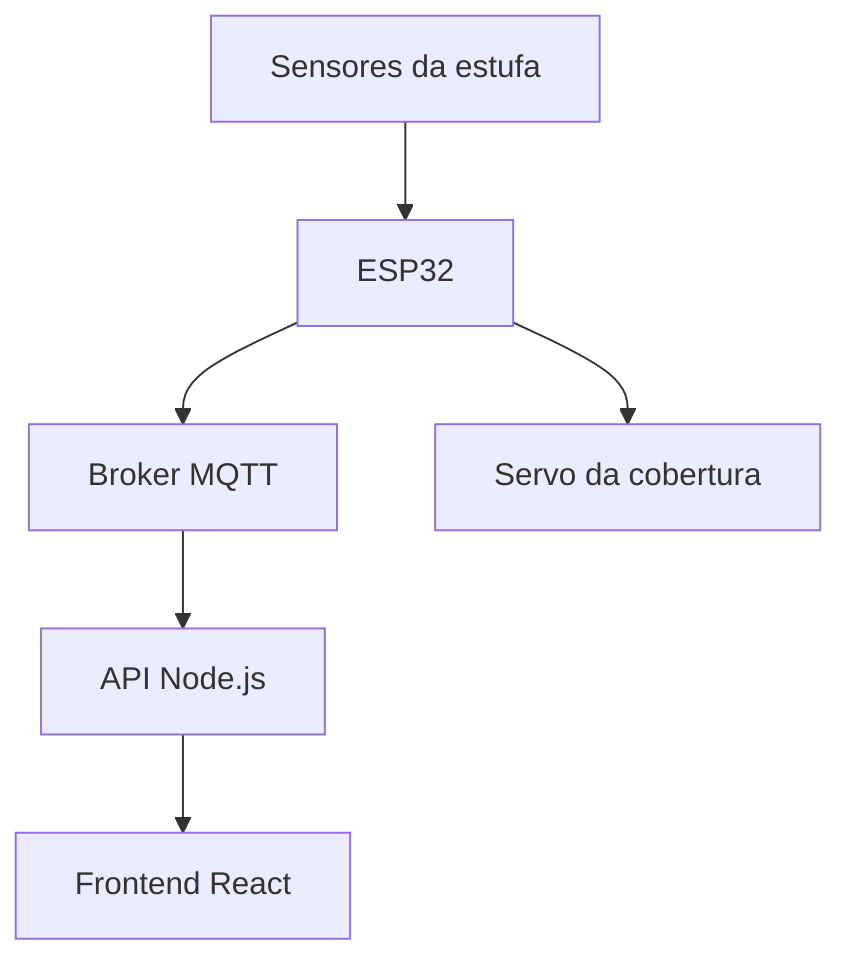

# 🌱 Estufa Inteligente

### Tecnologia para acompanhar e cuidar do ambiente de cultivo

Monitoramento de sensores e controle da cobertura com  
**ESP32 · MQTT · Node.js · React**

---

## 📖 Sobre o projeto

A **Estufa Inteligente** é um projeto que integra uma maquete física a uma aplicação web para acompanhar as condições do ambiente de cultivo.

Sensores conectados ao **ESP32** coletam informações de temperatura, umidade do ar, chuva e movimento. Os dados são enviados por **MQTT**, recebidos por uma **API em Node.js** e apresentados em uma interface desenvolvida em **React**.

O projeto também utiliza um **servo motor para movimentar a cobertura da estufa**, permitindo demonstrar o controle automático a partir das leituras dos sensores.

> 🌿 **Objetivo:** visualizar as condições da estufa e compreender como sensores, automação e desenvolvimento web podem trabalhar juntos.

---

## ✨ Funcionalidades

| Recurso | Descrição |
|:--|:--|
| 🌡️ **Temperatura** | Acompanhamento da temperatura do ambiente. |
| 💧 **Umidade do ar** | Exibição da umidade medida pelo sensor DHT. |
| 🌧️ **Chuva** | Identificação da presença de água no sensor de chuva. |
| 🚶 **Movimento** | Indicação de presença detectada pelo sensor PIR. |
| 🏠 **Cobertura** | Movimentação por servo motor e acompanhamento do estado aberto ou fechado. |
| 📡 **Comunicação MQTT** | Envio das informações do ESP32 para o sistema. |
| 🖥️ **Painel web** | Visualização das informações em uma interface responsiva. |

---

## 🔄 Como funciona

1. Os **sensores** coletam as informações do ambiente.
2. O **ESP32** processa as leituras e controla o servo conforme a lógica programada.
3. O **broker MQTT** recebe as mensagens publicadas pelo ESP32.
4. A **API** recebe os dados para disponibilizá-los à aplicação web.
5. O **frontend** apresenta as informações no painel e nas páginas de cada sensor.

---

## 🛠️ Tecnologias utilizadas

### Hardware e programação embarcada

- **ESP32** — leitura dos sensores e comunicação com a rede.
- **Arduino IDE e C++** — desenvolvimento do código embarcado.
- **DHT11** — leitura de temperatura e umidade do ar no circuito físico.
- **Sensor de chuva** — identificação de água na superfície do sensor.
- **Sensor PIR** — detecção de movimento.
- **Servo motor** — movimentação da cobertura.
- **LCD 16×2 I2C** — apresentação de informações no circuito.

### Comunicação e backend

- **MQTT** — troca de mensagens entre o dispositivo e o sistema.
- **HiveMQ Cloud** — broker utilizado na comunicação.
- **Node.js** — execução da API.

### Interface web

- **React** — construção das páginas.
- **React Router** — navegação entre as telas.
- **Tailwind CSS** — estilização e responsividade.
- **React Icons** — ícones da interface.

---

## 🖥️ Páginas da aplicação

| Página | Finalidade |
|:--|:--|
| **Início** | Apresentação do projeto e acesso às funcionalidades. |
| **Painel de Controle** | Visão geral das informações da estufa. |
| **Temperatura** | Acompanhamento das leituras de temperatura. |
| **Umidade do ar** | Visualização da umidade do ambiente. |
| **Chuva** | Acompanhamento do sensor de chuva e da cobertura. |
| **Movimento** | Exibição do estado de presença detectado pelo PIR. |

A interface utiliza **tons de rosa**, ícones e um menu lateral com adaptação para dispositivos móveis.

---

## 📡 Tópicos MQTT

| Tópico | Informação |
|:--|:--|
| `aula/27/temperatura` | Temperatura do ambiente. |
| `aula/27/umidadeAr` | Umidade relativa do ar. |
| `aula/27/statusChuva` | Estado do sensor de chuva. |
| `aula/27/cobertura` | Estado da cobertura. |
| `aula/27/presencaPir` | Presença detectada pelo sensor PIR. |

---

## 🧪 Testes e desenvolvimento

O desenvolvimento envolve testes individuais dos componentes e a integração entre hardware, comunicação e interface.

- **Sensores:** conferência das leituras pelo Monitor Serial.
- **Servo motor:** teste de movimentação e ajuste para a cobertura.
- **LCD:** teste de comunicação I2C e exibição de mensagens.
- **MQTT:** verificação da publicação e do recebimento dos dados.
- **Aplicação web:** conferência das páginas, navegação e apresentação das informações.

> 🚧 O projeto está em desenvolvimento. A integração completa deve ser validada com o circuito físico.

---

## 👩‍💻 Equipe

Desenvolvido por **Rafaela e Susany**.

**Curso:** Análise e Desenvolvimento de Sistemas — SENAI  
**Turma:** 3º B  
**Professor:** Ricardo Dias

---

**🌱 Projeto Estufa Inteligente**

*Sensores, automação e desenvolvimento web aplicados ao cultivo.*

