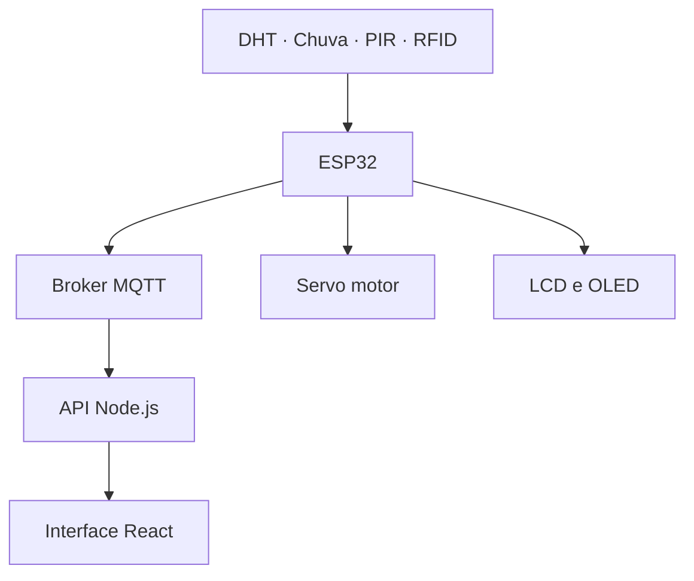

# 🌷 Estufa Inteligente
### Monitoramento ambiental • Automação • Identificação por RFID

Uma maquete conectada que integra sensores, controle da cobertura  
e uma interface web para acompanhar as condições da estufa.

 

 

**🌡️ Temperatura &nbsp; • &nbsp; 💧 Umidade &nbsp; • &nbsp; 🌧️ Chuva**  
**🚶 Presença &nbsp; • &nbsp; 🪪 RFID &nbsp; • &nbsp; 🏠 Cobertura automática**

---

## 🌿 Conheça o projeto

A **Estufa Inteligente** reúne eletrônica e desenvolvimento de sistemas em uma maquete de estufa com cobertura móvel.

O **ESP32** realiza a leitura dos sensores, controla o servo motor, atualiza os displays e publica informações por **MQTT**. A proposta de integração utiliza uma **API em Node.js** e um **frontend em React** para apresentar os dados em um painel de monitoramento.

O sistema também identifica cartões **RFID** e apresenta no **OLED** um símbolo indicando se o cartão foi permitido ou negado.

> 🌷 **Objetivo do projeto**  
> Demonstrar a integração entre sensores, automação, comunicação e interface web, permitindo acompanhar as condições da estufa e o funcionamento dos componentes.

---

## ✨ Recursos do sistema

| | Recurso | Funcionamento |
|:--:|:--|:--|
| 🌡️ | **Temperatura** | Leitura da temperatura ambiente pelo DHT. |
| 💧 | **Umidade do ar** | Leitura da umidade relativa do ambiente pelo DHT. |
| 🌧️ | **Detecção de chuva** | Leitura analógica e classificação conforme o limite configurado. |
| 🚶 | **Detecção de presença** | Identificação de movimento pelo sensor PIR. |
| 🪪 | **Identificação RFID** | Comparação do UID do cartão com o UID autorizado. |
| 🏠 | **Cobertura móvel** | Movimentação do telhado por servo motor. |
| 📟 | **LCD 16×2** | Exibição da umidade do ar e do estado do telhado. |
| 🖥️ | **OLED** | Exibição de ✓ para acesso permitido e X para acesso negado. |
| 📡 | **MQTT** | Publicação das leituras e dos estados do sistema. |

---

## 🔄 Integração do projeto

### Do circuito à tela

1. Os sensores e o leitor RFID fornecem informações ao **ESP32**.
2. O programa processa as leituras e atualiza os atuadores e displays.
3. As informações são publicadas nos **tópicos MQTT**.
4. A API e a aplicação web compõem a integração para visualização dos dados.

---

## 🌸 Sensores e componentes

### 🌡️ DHT — temperatura e umidade

Responsável por medir a **temperatura** e a **umidade do ar**.

- O código enviado está configurado para **DHT22**.
- Para o circuito físico com **DHT11**, o modelo deve ser alterado no programa.
- As leituras são realizadas em intervalos de **2 segundos**.
- Leituras inválidas geram uma mensagem no Monitor Serial.
- Valores diferentes da leitura anterior são publicados por MQTT.

### 🌧️ Sensor de chuva — controle da cobertura

O ESP32 realiza uma leitura analógica e compara o resultado com o limite **2000**.

| Condição no código atual | Classificação | Cobertura | Servo |
|:--|:--|:--|:--|
| Leitura maior ou igual a `2000` | Chuvoso | Aberta | `180°` |
| Leitura menor que `2000` | Sem chuva | Fechada | `0°` |

> Essa é a lógica implementada no código enviado. O limite e o sentido da leitura devem ser conferidos nos testes com o sensor físico.

### 🚶 PIR — detecção de presença

O sensor informa se há movimento detectado.

- **HIGH:** publica `Presenca detectada`.
- **LOW:** publica `Sem presenca`.
- A publicação acontece quando o estado muda.

### 🪪 RFID — identificação de cartões

O leitor **MFRC522** identifica o UID do cartão apresentado e compara com o UID autorizado.

| Resultado | OLED | Mensagem MQTT |
|:--|:--:|:--|
| UID autorizado | ✓ | `Permitido` |
| UID diferente | X | `Negado` |

O símbolo permanece no OLED por **2 segundos**. Em seguida, a tela é limpa.

A identificação indica o resultado da leitura; o código atual não aciona uma fechadura.

---

## 📟 Informações no circuito

<table>
<tr>
<th>LCD 16×2 I2C</th>
<th>OLED SSD1306</th>
</tr>
<tr>
<td>

Exibe as informações da estufa:

- Umidade do ar em porcentagem.
- Estado do telhado: aberto ou fechado.

Endereço I2C: <code>0x27</code>.

</td>
<td>

Exibe o resultado da identificação RFID:

- ✓ — acesso permitido.
- X — acesso negado.

Resolução: <strong>128 × 64</strong>.  
Endereço I2C: <code>0x3C</code>.

</td>
</tr>
</table>

---

## 🔌 Pinagem do código enviado

| Componente | Sinal | GPIO do ESP32 |
|:--|:--|:--:|
| DHT | Dados | `4` |
| Sensor de chuva | Saída analógica | `34` |
| Servo motor | Sinal de controle | `13` |
| PIR | Saída digital | `15` |
| LCD | SDA | `21` |
| LCD | SCL | `22` |
| OLED | SDA | `26` |
| OLED | SCL | `27` |
| RFID MFRC522 | SDA / SS | `5` |
| RFID MFRC522 | RST | `17` |
| RFID MFRC522 | SCK | `18` |
| RFID MFRC522 | MISO | `19` |
| RFID MFRC522 | MOSI | `23` |

**LCD e OLED utilizam barramentos I2C separados nesta versão.**  
No leitor RFID, o pino identificado como SDA é utilizado como seleção SPI — SS.

---

## 📡 Comunicação MQTT

O programa utiliza **HiveMQ Cloud**, com conexão na porta **8883**.

As mensagens são publicadas com a opção **retained**, permitindo que o broker mantenha a última mensagem de cada tópico.

| Tópico | Conteúdo publicado |
|:--|:--|
| `aula/27/temperatura` | Temperatura com uma casa decimal. |
| `aula/27/umidadeAr` | Umidade do ar com uma casa decimal. |
| `aula/27/statusChuva` | `Chuvoso` ou `Sem chuva`. |
| `aula/27/cobertura` | `Aberta` ou `Fechada`. |
| `aula/27/presencaPir` | `Presenca detectada` ou `Sem presenca`. |
| `aula/27/acessoRfid` | `Permitido` ou `Negado`. |

> As credenciais de conexão devem ser configuradas no ambiente de desenvolvimento e não incluídas neste README.

---

## 💻 Interface web

A aplicação utiliza **React**, navegação com **React Router**, estilização com **Tailwind CSS** e ícones do **React Icons**.

A identidade visual combina **rosa e roxo**, com menu lateral e adaptação para telas menores.

| Página | Descrição |
|:--|:--|
| 🏡 **Início** | Apresentação do projeto. |
| 📊 **Painel de Controle** | Visão geral do monitoramento. |
| 🌡️ **Temperatura** | Acompanhamento da temperatura ambiente. |
| 💧 **Umidade do ar** | Visualização da umidade relativa do ar. |
| 🌧️ **Chuva** | Informações sobre chuva e cobertura. |
| 🚶 **Movimento** | Indicação de presença detectada. |

---

## 🧰 Tecnologias e bibliotecas

| Área | Tecnologias |
|:--|:--|
| **Microcontrolador** | ESP32 |
| **Programação embarcada** | C++ e Arduino IDE |
| **Comunicação** | Wi-Fi e MQTT |
| **Broker** | HiveMQ Cloud |
| **Backend** | Node.js |
| **Frontend** | React e React Router |
| **Estilização** | Tailwind CSS e React Icons |
| **Simulação** | Wokwi |

### Bibliotecas do circuito

- `ESP32Servo`
- `DHT sensor library`
- `Adafruit Unified Sensor`
- `PubSubClient`
- `LiquidCrystal_I2C`
- `Adafruit GFX Library`
- `Adafruit SSD1306`
- `MFRC522`

O código também utiliza `WiFi`, `WiFiClientSecure`, `Wire` e `SPI`, disponíveis no pacote de suporte do ESP32.

---

## 🧪 Preparação para os testes

1. Configure a placa **ESP32 Dev Module** no Arduino IDE.
2. Instale as bibliotecas utilizadas pelo programa.
3. Confira a pinagem correspondente à versão do circuito.
4. Selecione o modelo correto do DHT.
5. Configure a rede Wi-Fi e os dados de conexão MQTT.
6. Ajuste o UID autorizado para o cartão utilizado.
7. Envie o programa para a placa.
8. Abra o **Monitor Serial em 115200 baud**.

A rede `Wokwi-GUEST` é utilizada na simulação. No circuito físico, configure a rede disponível no local.

---

## 👩‍💻 Equipe

### Rafaela & Susany

**Análise e Desenvolvimento de Sistemas — SENAI**  
Turma **3º B** · Professor **Ricardo Dias**

---

### 🌷 Estufa Inteligente
**Do sensor à interface, cada leitura conta uma parte do ambiente.**

Projeto educacional em desenvolvimento.

